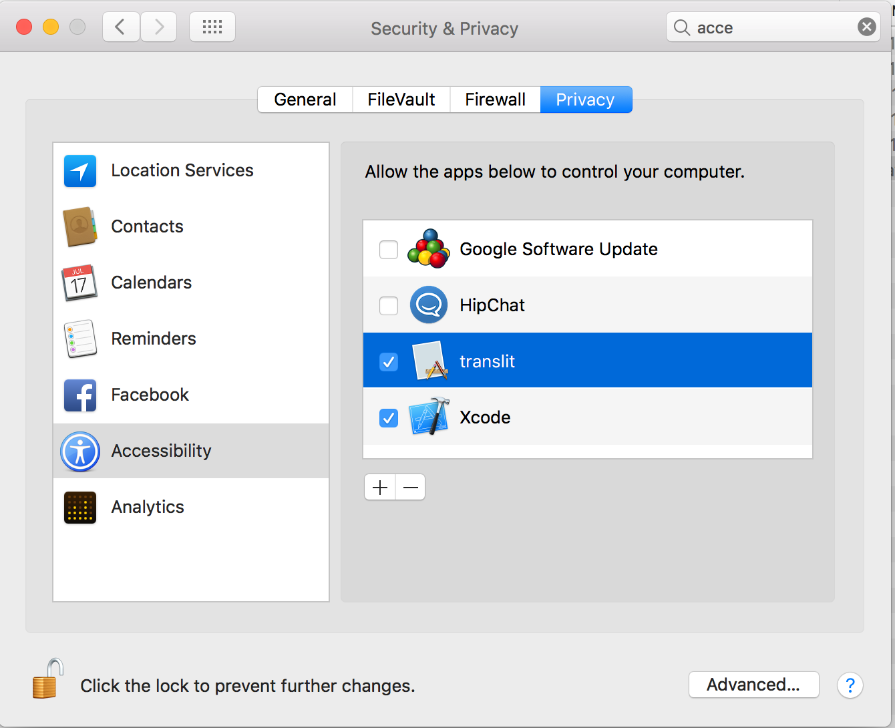

# Транслит для OSX

Микро утилита для перекодировки транслита в любом приложении macOS. Работает в браузерах, редакторах, почте, консоли … короче везде, даже без русского языка, добавленного в систему. Кодировка транслита “стандартная”, похожа на translit.net: zh -> ж, sh -> ш, shh -> щ, ‘ -> ь, и т.д. При необходимости, можно модифицировать кодировку непосредственно в файле `conf.json`. Там же можно поменять комбинацию клавиш активирующих перекодирование. По умолчанию: **left control + left option (alt)**. Инсталляция обычная - скопировать [содержимое архива](https://github.com/oizmerly/translit/tree/master/bin) в любую папку. Можно скомпилировать проект самостоятельно.

Утилита перехватывает глобальные сообщения от клавиатуры, и должно быть добавлено в Security & Privacy -> Accessibility -> “apps to control your computer”. По этой-же причине невозможно распространять приложение через Apple App Store.

## Почему "Ы" на иконке?

[Почему "Ы"?](https://youtu.be/efdYk84GnLw)

## License
THE SOFTWARE IS PROVIDED "AS IS", WITHOUT WARRANTY OF ANY KIND, EXPRESS OR
IMPLIED, INCLUDING BUT NOT LIMITED TO THE WARRANTIES OF MERCHANTABILITY,
FITNESS FOR A PARTICULAR PURPOSE AND NONINFRINGEMENT. IN NO EVENT SHALL THE
AUTHORS OR COPYRIGHT HOLDERS BE LIABLE FOR ANY CLAIM, DAMAGES OR OTHER
LIABILITY, WHETHER IN AN ACTION OF CONTRACT, TORT OR OTHERWISE, ARISING FROM,
OUT OF OR IN CONNECTION WITH THE SOFTWARE OR THE USE OR OTHER DEALINGS IN THE
SOFTWARE.
